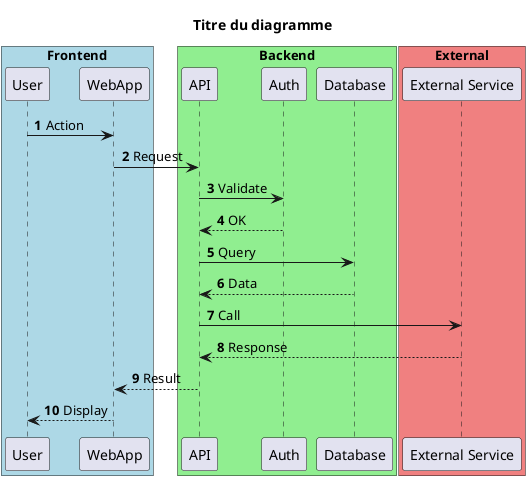
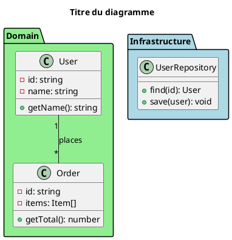
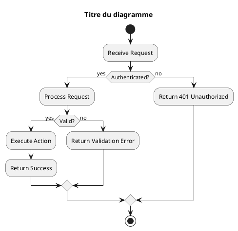
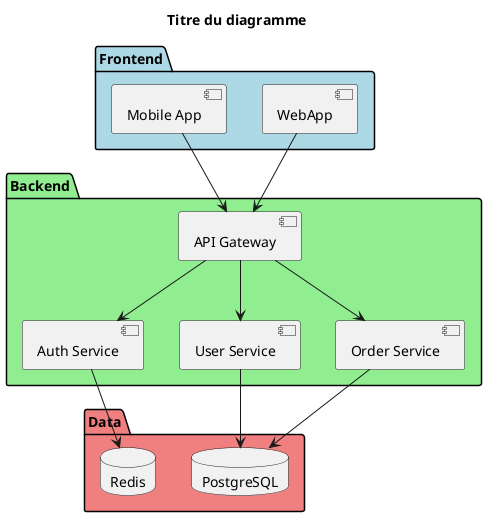

# PlantUML Editor

Crée ou édite un diagramme PlantUML via Plant Editor.

**Demande:** $ARGUMENTS

## Comportement

- **Sois CONCIS** : pas d'explications, pas de récapitulatif, juste le lien
- Ne demande rien sauf si un commentaire est ambigu
- Après création/modification, donne UNIQUEMENT le lien : `https://plant-editor.kepochan.com/diagram/<UUID>`
- Ne propose PAS de sauvegarder dans un fichier sauf si demandé
- **ATTENTION** : Le lien utilisateur est sur `plant-editor.kepochan.com`, PAS sur `plant-editor-api.kepochan.com`

## API

```bash
# Créer/Modifier
curl -X POST https://plant-editor-api.kepochan.com/diagram \
  -H "Content-Type: application/json" \
  -H "X-API-Key: $PLANT_EDITOR_API_KEY" \
  -d '{"sessionId": "<UUID>", "code": "@startuml\n...\n@enduml"}'

# Récupérer commentaires
curl "https://plant-editor-api.kepochan.com/comments?sessionId=<UUID>" \
  -H "X-API-Key: $PLANT_EDITOR_API_KEY"
```

## Conventions PlantUML

1. **`title`** - OBLIGATOIRE, toujours mettre un titre descriptif
2. **`autonumber`** - Toujours activer la numérotation automatique
3. **Box colorées** pour les macro-composants :
   - Frontend : `#LightBlue`
   - Backend : `#LightGreen`
   - Services externes : `#LightCoral`
4. **Participants** - Noms en trigramme ou 4 lettres minuscules (ex: `usr`, `api`, `db`, `auth`)
5. **Retours** - Toujours utiliser `-->` (flèche pointillée) pour les réponses
6. **JAMAIS utiliser** `activate` / `deactivate`

## Templates

### Sequence Diagram


### Class Diagram


### Activity Diagram


### Component Diagram

