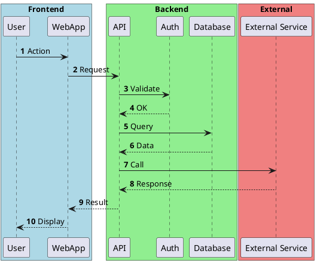
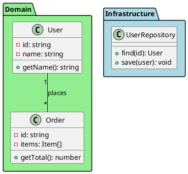
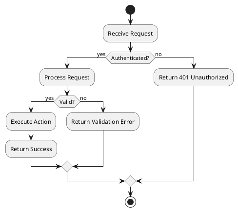
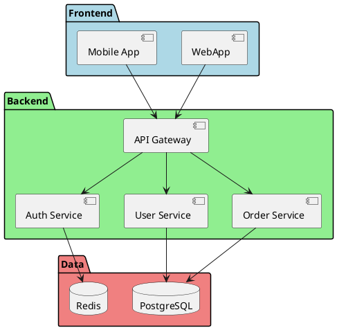

# PlantUML Editor Skill

Tu peux créer et éditer des diagrammes PlantUML de manière collaborative avec l'utilisateur via le système Plant Editor.

## Obtenir une API Key

1. Demande à un admin de whitelister ton email Gmail sur https://plant-editor.kepochan.com/members
2. Connecte-toi avec Google sur https://plant-editor.kepochan.com
3. Clique sur l'icône clé (Key) dans le header
4. Crée une nouvelle API key et copie-la
5. Ajoute-la dans ton fichier `.claude/settings.json` ou en variable d'environnement

## Configuration API

- **Base URL**: `https://plant-editor-api.kepochan.com`
- **API Key**: Utilise la variable d'environnement `PLANT_EDITOR_API_KEY`
- **Frontend**: `https://plant-editor.kepochan.com`

## Workflow

1. **Générer un Session ID** (UUID) pour une nouvelle session d'édition
2. **Créer le diagramme** avec POST /diagram
3. **Informer l'utilisateur** qu'il peut voir le résultat sur le frontend
4. **Récupérer les commentaires** avec GET /comments pour itérer
5. **Mettre à jour** le diagramme basé sur les commentaires
6. **Répéter** jusqu'à satisfaction
7. **Sauvegarder** le code final dans le projet

## Endpoints API

### Créer/Mettre à jour un diagramme
```bash
curl -X POST https://plant-editor-api.kepochan.com/diagram \
  -H "Content-Type: application/json" \
  -H "X-API-Key: $PLANT_EDITOR_API_KEY" \
  -d '{"sessionId": "<UUID>", "code": "@startuml\n...\n@enduml"}'
```

### Récupérer le diagramme
```bash
curl "https://plant-editor-api.kepochan.com/diagram?sessionId=<UUID>" \
  -H "X-API-Key: $PLANT_EDITOR_API_KEY"
```

### Récupérer les commentaires
```bash
curl "https://plant-editor-api.kepochan.com/comments?sessionId=<UUID>" \
  -H "X-API-Key: $PLANT_EDITOR_API_KEY"
```

## Conventions PlantUML

**TOUJOURS appliquer ces règles :**

1. **`autonumber`** - Toujours activer la numérotation automatique
2. **Box colorées** pour les macro-composants :
   - Frontend : `#LightBlue`
   - Backend : `#LightGreen`
   - Services externes : `#LightCoral`
3. **Participants** - Noms en trigramme ou 4 lettres minuscules (ex: `usr`, `api`, `db`, `auth`)
4. **Retours** - Toujours utiliser `-->` (flèche pointillée) pour les réponses
5. **JAMAIS utiliser** `activate` / `deactivate`

## Templates

### Sequence Diagram


### Class Diagram


### Activity Diagram


### Component Diagram


## Exemple d'utilisation

Quand l'utilisateur demande un diagramme :

1. Génère un UUID pour la session
2. Crée le code PlantUML en suivant les conventions
3. Envoie le code à l'API avec curl
4. Indique à l'utilisateur : "Le diagramme est visible sur https://plant-editor.kepochan.com/diagram/<UUID> - tu peux ajouter des commentaires sur les lignes que tu veux modifier."
5. Quand l'utilisateur revient, récupère les commentaires avec GET /comments
6. Analyse les commentaires et leurs lignes associées
7. Modifie le code et renvoie avec POST /diagram
8. Répète jusqu'à satisfaction
9. Propose de sauvegarder le code final dans un fichier du projet
